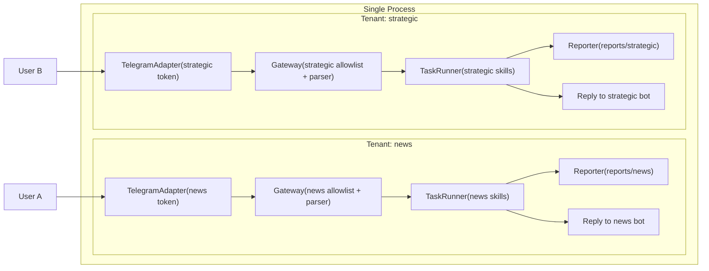
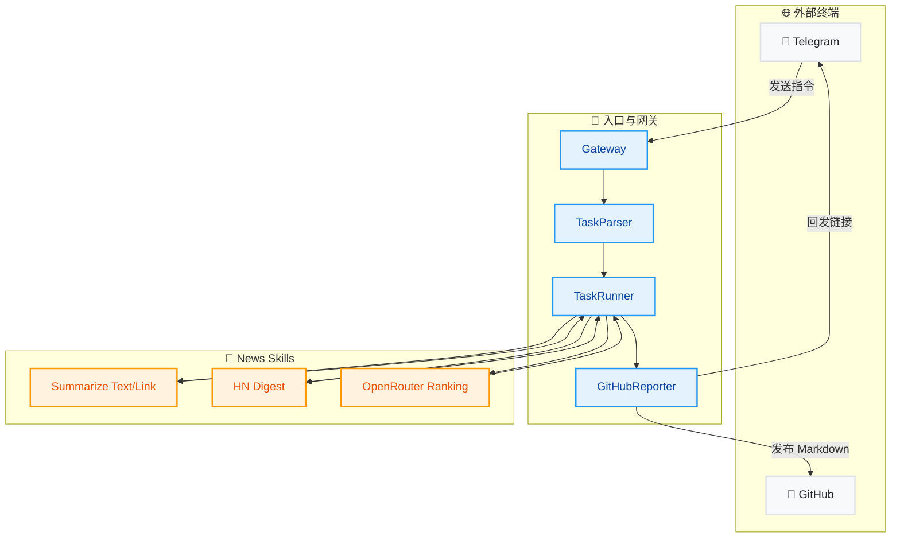
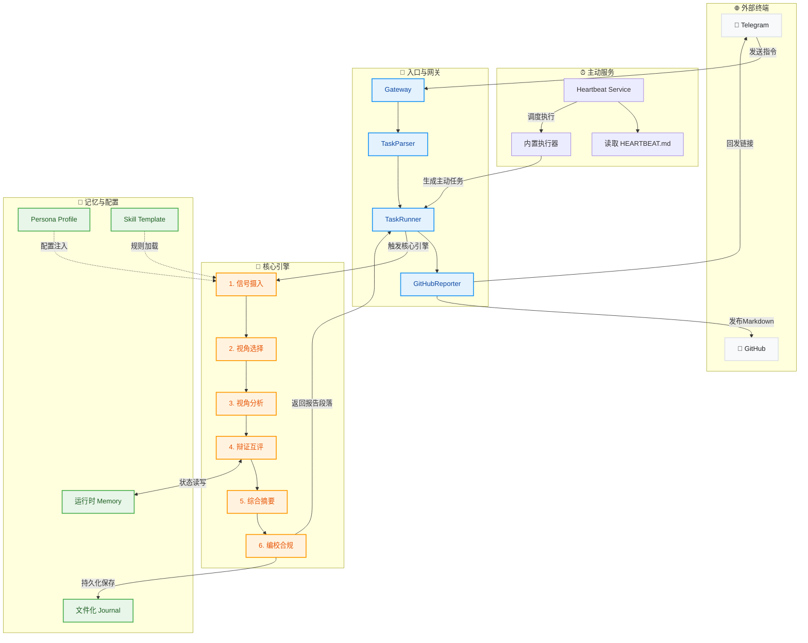

# Product Overview

本仓库当前包含两个并行、同级能力模块：

1. **News Editer Agent (MVP)**：新闻采编与结构化总结
2. **Strategic Research Crew (Spec v1.0)**：多镜头战略研究与情景推演

二者建议使用独立 bot 与独立命令集运行，避免互相干扰；处理流程与输出目标也保持分离。

## Feature A — News Editer Agent (MVP)

面向“数字员工”场景的新闻采编 Agent。

当前版本目标：
- 私聊 Telegram 下发任务
- 支持链接总结、长文本总结、原文中英重写、Hacker News 分析、OpenRouter 综合热度分析
- 总结任务支持固定“结构化文档模板”（标题、概念、关系、FAQ、Mermaid、金句等）
- 任务执行会自动写入 `memory/YYYY-MM-DD.md`（含 requestId、任务类型、成功/失败状态）
- 任务执行完后，Telegram 返回短摘要 + GitHub 详细报告链接
  - 若未配置 GitHub，则仅返回 TG 短摘要

## 架构

```text
Telegram(private chat)
  -> Gateway (allowlist + queue + task parsing)
  -> TaskRunner
      -> Skills (rewrite_bilingual / summarize_text / summarize_link / hn_digest / openrouter_ranking)
  -> GitHubReporter (markdown report)
  -> Telegram short reply + report link
```

后续接入飞书时，只需要新增一个 `ChannelAdapter` 实现并接入 `Gateway`。

## 多租户 Gateway 概念（OpenClaw 风格）

在本项目里：

- `tenant` = 一个独立 bot 的工作空间（独立 token / 白名单 / 命令路由 / 报告路径）
- `gateway` = 该 tenant 的消息入口与调度边界

当前实现不是“一个大 gateway 管所有租户”，而是“单进程内并行多个 gateway 实例”，每个 tenant 一套：

- `TelegramAdapter`
- `Gateway`
- `TaskRunner`
- `Reporter`

这样实现的效果是：共享代码，不共享运行态身份和租户数据边界。



## 两个 Feature 的流程差异（Mermaid）

### Flow A: News Editer Agent（风格化）



### Flow B: Strategic Research Crew（风格化）



### 关键差异总结

- **News Editer Agent**：偏内容采编与总结（单任务/组合任务），输出以编辑报告为主。
- **Strategic Research Crew**：偏状态机分析与情景推演，包含镜头分析、互评、记忆落盘与审校。
- 两者都可发布到 GitHub，但 Strategic 输出是“战略结构化完整报告”，并写入长期记忆文件。

## 新增渠道（如飞书）

1. 在 `src/channels/` 新建 adapter，实现 `ChannelAdapter` 接口：
   - `start(onMessage)`：把平台消息转成 `IncomingMessage`
   - `sendMessage(chatId, text)`：统一发送能力
2. 在 `src/index.ts` 注入该 adapter 并交给 `Gateway`
3. 保持 `Skill` 与 `TaskRunner` 不变

## 快速开始

1. 安装依赖

```bash
npm install
```

2. 复制配置

```bash
cp .env.example .env
```

3. 填写 `.env`

- `AGENT_TENANTS`: 逗号分隔的租户列表（如 `news,strategic`），单进程会并行启动多个 Agent
- `<TENANT>_AGENT_ROLE`: 每个租户的能力角色（`news` 或 `strategic`）
- `<TENANT>_TELEGRAM_BOT_TOKEN`: 每个租户独立 bot token（例如 `NEWS_TELEGRAM_BOT_TOKEN`）
- `<TENANT>_TELEGRAM_ALLOWED_USER_IDS` / `<TENANT>_TELEGRAM_ALLOWED_CHAT_IDS`: 每个租户独立白名单
- `<TENANT>_REPORT_BASE_PATH`: 每个租户独立报告目录（不配则默认 `reports/<tenant>`）
- `<TENANT>_STRATEGIC_INSUFFICIENT_SIGNAL_THRESHOLD`: strategic 租户的置信度阈值（默认 `0.35`）
- `<TENANT>_PERSONA_WORKSPACE`: persona 文件根目录（默认当前项目目录）
- `<TENANT>_SOUL_FILE` / `<TENANT>_IDENTITY_FILE` / `<TENANT>_USER_FILE`: 指定该租户使用的 persona 文件

- `TELEGRAM_BOT_TOKEN`: Telegram Bot token（兼容兜底，不推荐共享给两个 Agent）
  - 支持填写纯 token 或 `bot<token>`，程序会自动清洗
- `TELEGRAM_ALLOWED_USER_ID`: 单个允许用户 ID
- `TELEGRAM_ALLOWED_USER_IDS`: 多个允许用户 ID（逗号分隔）
- `TELEGRAM_ALLOWED_CHAT_ID`: 单个允许 chat ID（可选）
- `TELEGRAM_ALLOWED_CHAT_IDS`: 多个允许 chat ID（逗号分隔，可选）
- `TELEGRAM_LONG_POLL_TIMEOUT_SEC`: TG long polling 超时秒数（默认 10）
- `TELEGRAM_FORCE_SHORT_POLL`: 是否强制短轮询（`1`/`0`，默认 `0`）
- `TELEGRAM_TRANSPORT`: `fetch` 或 `curl`（网络不稳定时建议 `curl`）
- `OPENROUTER_API_KEY`: OpenRouter API key（可选；缺失时会提示配置，无法生成模型总结）
  - 兼容别名：`openrouter_API_KEY` / `openrouter_api_key`
- `OPENROUTER_MODEL`: 用于总结的模型 ID
- `OPENROUTER_FALLBACK_MODELS`: 备用模型列表（逗号分隔）。当主模型返回地区限制（403）时会自动降级重试
- `GITHUB_TOKEN`: 具有 repo 写权限的 token（可选）
- `GITHUB_REPO`: `owner/repo`（可选）
  - 兼容别名：`GITHUB_REPOSITORY`
- `GITHUB_BRANCH`: 报告写入分支，默认 `main`（分支不存在时会自动回退到仓库默认分支重试）
- `REPORT_BASE_PATH`: 报告目录，默认 `reports`

4. 启动

```bash
npm run dev
```

## 指令示例

按租户运行后，命令按租户角色严格隔离：

- `<TENANT>_AGENT_ROLE=news`：该租户只接受新闻采编命令（总结链接/文本、中英重写、HN、OpenRouter）
- `<TENANT>_AGENT_ROLE=strategic`：该租户只接受 `战略研究/战略/strategy` 命令

- 链接总结
  - `总结 https://example.com/article`
- 长文本总结
  - 直接发一段长文本给 Bot
- 原文中英重写
  - `重写 这里放原文`
  - `改写这段原文，用中英各写一版：...`
- Hacker News
  - `抓取 hn top 10 并分析`
- OpenRouter
  - `抓取 openrouter top 10 做综合分析，热度优先`
- 多任务
  - `任务：总结 https://x.com/... + 抓取 hn top 10 + 抓取 openrouter top 10`

## 结构化总结模板（默认）

`总结链接` 与 `长文本总结` 默认使用统一模板输出，主要结构如下：

1. 标题
2. 整体结构化文档表达
3. 处理流程
4. 概念清单（中英文）
5. 概念定义（中英文）
6. 概念关联与逻辑关系（中英文，含公式/逻辑表达）
7. COT 逻辑梳理（定义/分类/比较/因果/科学方法论）
8. 事实与看法（病毒）
9. FAQ（原文问题整理）
10. Visualization（Mermaid，分 subgraph）
11. 文章中的类比
12. 10 个金句

说明：
- 模板要求“仅基于原文”，缺失信息必须标注“未提及/未发现明确内容”
- Mermaid 图节点和连线需使用文章真实概念，不允许保留占位词
- Mermaid 语法要求“每行一条边”；若模型输出 `A + B --> C`，系统会自动改写为 `A --> C` 与 `B --> C`
- 概念项必须给出中英文形式（如：注意力机制 / Attention Mechanism）

## OpenClaw 风格对齐点（MVP）

- 通道与执行逻辑解耦：`ChannelAdapter` 与 `TaskRunner` 分离
- 任务可扩展：每个能力是独立 `Skill`
- 安全入口：私聊 + allowlist
- 输出分层：即时短消息 + 外部详细报告链接

## 已知限制

- OpenRouter “热度”暂无官方分值接口，当前以 API 返回顺序作为热度近似参考
- 当前支持单进程多租户并行运行；单租户内部仍是顺序队列。生产环境建议切到 Redis/BullMQ
- Telegram 使用 long polling；生产可迁移 webhook

## 网络排障（Telegram 连接报 ECONNRESET）

如果持续出现 `fetch failed / ECONNRESET`：

1. 降低 long poll 超时
   - `TELEGRAM_LONG_POLL_TIMEOUT_SEC=8`
2. 强制短轮询（禁用长连接）
   - `TELEGRAM_FORCE_SHORT_POLL=1`
3. 使用代理（如果你的网络环境需要）
   - `NODE_USE_ENV_PROXY=1`
   - `HTTPS_PROXY=http://127.0.0.1:7890`
4. 保留 `POLL_INTERVAL_MS=1500` 或更高，避免过高请求频率
5. 切换 Telegram 传输层（推荐）
   - `TELEGRAM_TRANSPORT=curl`

如果出现 `Unauthorized`：

1. 在 BotFather 重新生成 token 后，必须更新对应租户的 `<TENANT>_TELEGRAM_BOT_TOKEN`（例如 `NEWS_TELEGRAM_BOT_TOKEN`）
2. 关闭并重启进程（确保读取最新 `.env`）
3. 用同一个 token 验证：
   - `curl "https://api.telegram.org/bot<token>/getMe"`
   - `curl "https://api.telegram.org/bot<token>/getUpdates?timeout=1"`

## 报告发布排障（GitHub）

如果 Telegram 返回“详细报告未发布”：

1. 检查 `.env` 是否设置：
   - `GITHUB_TOKEN=...`
   - `GITHUB_REPO=owner/repo`
   - `GITHUB_BRANCH=main`（可选）
2. 确认 token 有仓库内容写权限（`repo` 或 Fine-grained token 的 `Contents: Read and write`）
3. 若分支名写错，程序会自动回退默认分支重试；仍失败时会在 Telegram 显示具体错误摘要

## 模型地区限制排障（OpenRouter 403）

如果出现 `this model is not allow(ed) in your region`：

1. 修改 `.env`：
   - `OPENROUTER_MODEL=<你账号可用模型>`
   - `OPENROUTER_FALLBACK_MODELS=<模型1>,<模型2>`
2. 程序会在主模型不可用时自动切换到备用模型
3. 重启进程后重试任务

可直接尝试的免费模型配置示例：

```env
OPENROUTER_MODEL=stepfun/step-3.5-flash:free
OPENROUTER_FALLBACK_MODELS=qwen/qwen-2.5-72b-instruct:free,deepseek/deepseek-chat:free
```

## 微信公众号链接提取（mp.weixin.qq.com）

已内置微信文章专用提取策略：

1. 优先抽取正文容器（`#js_content` / `.rich_media_content`）
2. 自动提取标题（`og:title` / 页面标题容器）
3. 使用更接近浏览器的请求头与 Referer
4. 多级回退：正文容器提取失败时，回退到通用内容抽取
5. 识别常见风控页（如“环境异常/访问频繁”）并返回明确错误

使用建议：

- 发送纯净链接：`https://mp.weixin.qq.com/s/...`
- 链接末尾即使带中文标点（如 `。`、`）`），系统也会自动清洗
- 若仍失败，优先检查网络/代理是否可访问 `mp.weixin.qq.com`

## Feature B — Strategic Research Crew (Spec v1.0)

仓库已新增 `src/strategic/` 目录，实现基于状态机的多层战略研究引擎：

- `Signal Intake`：信号结构化、打分与存储
- `Lens Selection`：Theme→Lens 规则候选 + 动态收窄
- `Parallel Lens Analysis`：多镜头并行分析（结构化输出）
- `Dialectic`：单轮结构化互评（含置信度调整）
- `Synthesis`：基准/替代情景与监控信号
- `Editorial Governance`：一轮审校与一次修订控制
- `Memory Stores`：Signal / Theme Cluster / Thesis / Lens Performance 四类存储
- `Cadence`：daily / weekly / monthly 模式

### 快速调用示例

```ts
import { StrategicResearchOrchestrator } from "./strategic/index.js";

const orchestrator = new StrategicResearchOrchestrator({
  cadence: "weekly",
  phase: "phase4",
  insufficientSignalThreshold: 0.4
});

const result = await orchestrator.run({
  text: "某国发布新的先进芯片出口管制草案，相关供应链与资本市场快速波动。",
  sourceType: "news"
});
```

说明：

- `phase1` 仅执行 Layer 1~3（Dialectic/Synthesis 使用 stub）
- `phase2` 增加 Dialectic + Synthesis
- `phase3` 增加 Editorial Governance + Memory Stores
- `phase4` 增加 Cadence 控制（完整流）

### How to Use it via TG

发送以下格式即可触发战略研究流程：

- `战略研究: weekly phase4 AI芯片出口限制影响全球供应链`
- `战略: daily phase1 某平台发布新模型引发开发者迁移`
- `strategy: monthly phase4 central bank policy shift and liquidity shock`

参数说明：

- cadence：`daily` / `weekly` / `monthly`（默认 `weekly`）
- phase：`phase1` / `phase2` / `phase3` / `phase4`（默认 `phase4`）
- 正文：其余文本会作为 signal 输入

返回结果：

- TG 短消息会返回 base/alternative/confidence 摘要
- 若配置了 GitHub 报告发布，会附带完整结构化报告链接
- 战略研究任务会生成“结构化完整报告”（TL;DR / 假设 / 证据推理 / Base&Alt / Watchlist / Next Actions / Machine Trace）并发布到 GitHub

### Strategic Research Crew 个性化风格（SOUL / IDENTITY / USER）

可在 OpenClaw workspace 目录放置以下文件来自定义战略研究回复风格：

- `SOUL.md`：沟通风格与工作方式（如“直接切入主题”“允许表达观点”“简洁优先”）
- `IDENTITY.md`：助手名称与符号标识
- `USER.md`：用户称呼/时区/背景等偏好

默认读取路径：`<项目根目录>/workspace`。
也可通过环境变量指定：

```env
OPENCLAW_WORKSPACE=/path/to/openclaw/workspace
```

当你通过 TG 发送战略研究任务时（如 `战略研究: weekly phase4 ...`），系统会自动加载上述文件，并把风格应用到：

- TG 短摘要语气（更直接/更简洁）
- 报告中的叙事总结（Narrative Summary）
- 是否附带“观点”段落（由 SOUL.md 规则控制）

如果三个文件为空或不存在，会回退到默认中性风格。

### Strategic Memory MVP（参考 OpenClaw）

Strategic Research Crew 已接入一版文件型记忆系统（MVP），每次执行 `strategic_research` 都会写入：

```text
MEMORY.md
memory/
  ├── projects.md
  ├── infra.md
  ├── lessons.md
  └── YYYY-MM-DD.md
```

说明：

- `MEMORY.md`：核心索引，只保留最新关键信息与文件引用
- `memory/projects.md`：按请求记录主题、镜头、状态与摘要
- `memory/infra.md`：运行时快照（store 规模、更新时间）
- `memory/lessons.md`：不确定性、监控信号、互评要点沉淀
- `memory/YYYY-MM-DD.md`：按日完整执行日志

默认写入项目根目录；可通过环境变量覆盖：

```env
STRATEGIC_MEMORY_DIR=/path/to/dir
```

### OpenClaw Skill Package（已抽离）

`Strategic Research Crew` 的执行规范已按 OpenClaw 模版抽离到仓库目录：

```text
skills/
  strategic-research/
    SKILL.md
    execute.sh
    README.md
```

其中 `SKILL.md` 明确了：
- 触发条件
- 执行流程
- 输出规范

可通过脚本本地触发一次结构化运行（需先 `npm run build`）：

```bash
bash skills/strategic-research/execute.sh \
  --text "AI芯片出口限制影响全球供应链" \
  --cadence weekly \
  --phase phase4
```

## Heartbeat（主动服务巡检）

已新增 Heartbeat 机制：系统会按间隔触发巡检任务（默认每 30 分钟），并将结果发布为 GitHub 报告链接（若已配置 GitHub reporter），同时推送到允许列表中的一个 TG chat。

### 如何启用规则

在项目根目录创建 `HEARTBEAT.md`，例如：

```markdown
# HEARTBEAT.md

## 每次心跳时执行
- 检查核心服务健康状态(通过 HTTP 探测) https://example.com/health
- 如果发现异常,立即通知但不要自动干预

## 每日执行一次
- 扫描项目待办列表,标记超过 3 天未更新的任务

## 每周执行一次
- 整理过去 7 天的对话日志,提炼关键信息到长期记忆
```

### 内置执行器（MVP）

- 健康检查：识别条目中的 URL 或使用 `HEARTBEAT_HEALTH_URLS`
- 每日待办扫描：扫描 `TODO.md` / `memory/projects.md` 中超过 3 天未更新项
- 每周记忆整理：从 `memory/YYYY-MM-DD.md` 提炼并生成 `memory/weekly-YYYY-WW.md`

### 配置项

- `HEARTBEAT_ENABLED=1|0`（默认 `1`）
- `HEARTBEAT_INTERVAL_MS`（默认 `1800000`）
- `HEARTBEAT_HEALTH_URLS`（可选，逗号分隔）
